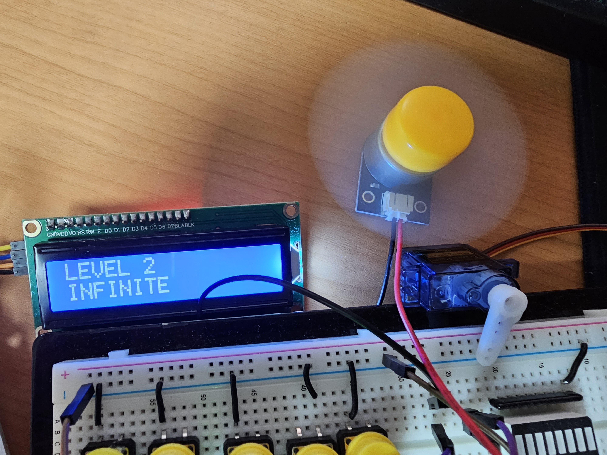

# Simple Fan

stm32로 만든 간단한 기능을 하는 선풍기
---

### clock 주파수 100MHz

1. 정지 기능
2. 1단 2단 3단 모터 출력
3. 각 단계 LED 등으로 표시
4. 각 단계 LCD에 표시하기
5. SERVO 모터를 사용하여 선풍기 목 회전 구현
6. UART 통신으로 타이머 값을 전달하여 타이머 가능 추가 (0~9)분까지 타이머 가능

---

1. 정지 상태

   

2. 1단 상태

   

3. 2단 상태

   

4. 3단 상태

   

5. 3단에서 회전 상태

   

6. Timer 작동

   

7. 동영상
   [시연 동영상](https://photos.onedrive.com/share/F234627C186506A6!7074?cid=F234627C186506A6&resId=F234627C186506A6!7074&authkey=!AKWiqnF5VARFWU8&ithint=video&e=Pcex3M)
